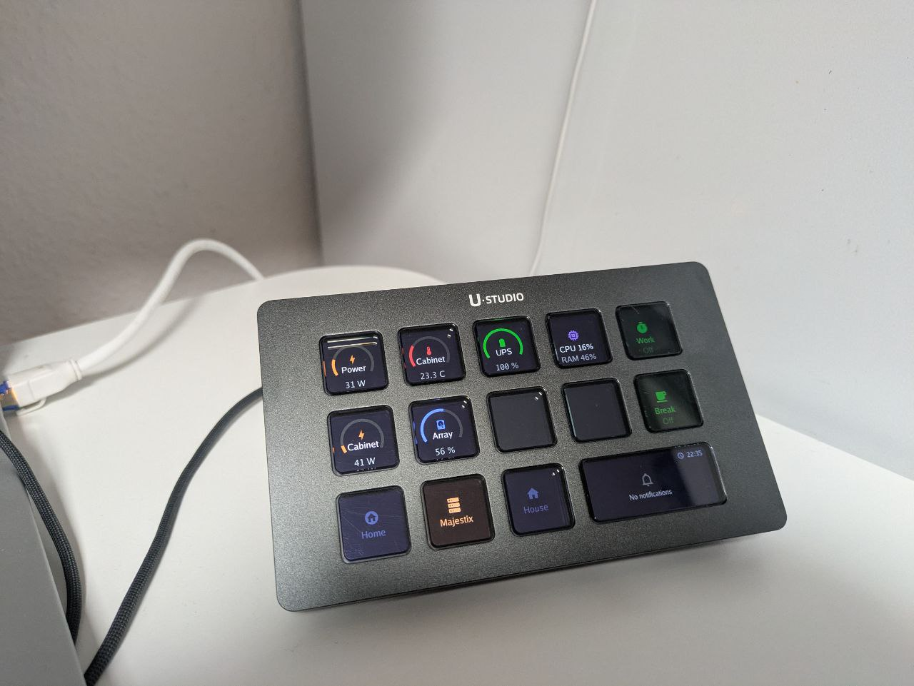
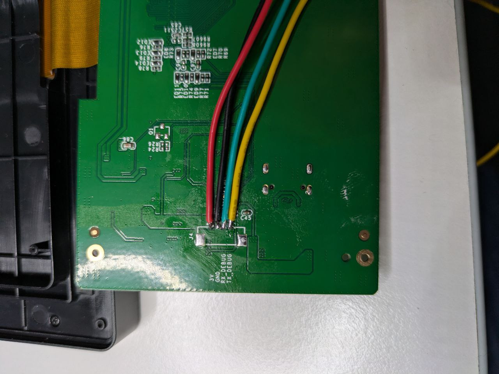
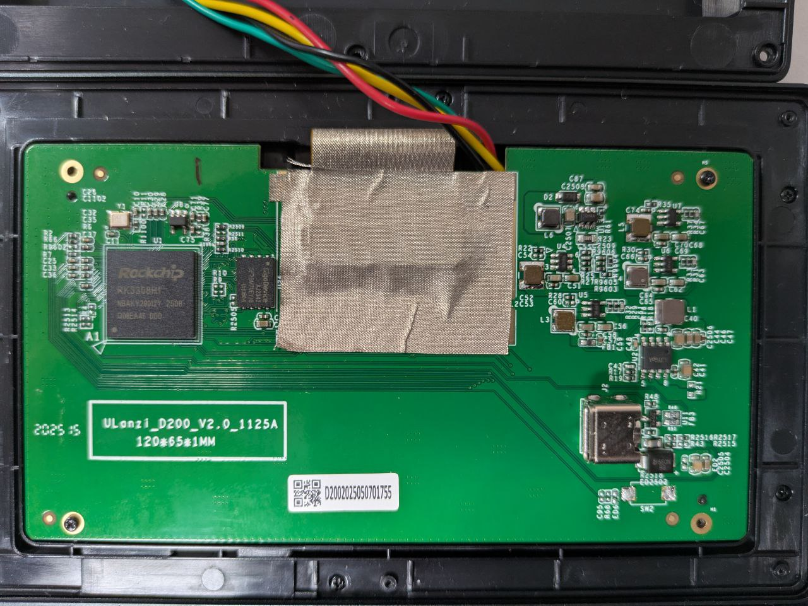

# Ulanzi D200 Preparation Guide



> **WARNING:** This guide involves soldering onto a PCB, flashing a modified boot image, and altering system files on the D200. These changes will void your warranty and carry a risk of bricking the device if done incorrectly. Proceed at your own risk.

The D200 runs a Rockchip RK3308 Linux system. Out of the box the UART (`/dev/ttyFIQ0`) is used as a kernel debug console and the stock Ulanzi application occupies the display. This guide walks through the hardware and software changes needed before the ESPHome bridge can work.

You need **ADB access** to the D200 for all software steps. Connect via USB and verify with `adb devices`.

---

## 1. Hardware: Solder UART Wires

The RK3308 debug UART is exposed as test pads on the D200 main board. You need to solder four wires:

| Pad    | Signal | Connect to ESP32       |
|--------|--------|------------------------|
| TX     | UART TX (D200 transmit) | ESP32 RX pin  |
| RX     | UART RX (D200 receive)  | ESP32 TX pin  |
| VCC    | 3.3 V                   | ESP32 3V3 pin |
| GND    | Ground                  | ESP32 GND pin |

**Tips:**
- Use thin silicone-insulated wire (e.g. 28 AWG) to keep the assembly compact.
- Apply flux and use a fine soldering tip — the pads are small.
- Double-check with a multimeter that VCC reads 3.3 V, not 5 V. Feeding 5 V into an ESP32 UART pin will damage it.
- TX/RX are crossed: the D200's TX connects to the ESP32's RX and vice versa.



## 2. Hardware: Route Wires Outside the Enclosure

The four wires need to exit the D200 case so they can reach the ESP32:

- Route the wires from the solder points along the back of the PCB toward the edge where the display cable is routed.
- File or drill a small hole in the rear housing to pass the wires through. The bottom edge across the USB-C port hole works well.
- Use hot glue or Kapton tape to secure the wires and provide strain relief where they exit.
- Reassemble the case and verify nothing is pinched.



---

## 3. Software: Disable the Kernel Console on UART

By default the RK3308 uses `/dev/ttyFIQ0` as a kernel console, printing boot messages and providing a login shell. This must be disabled so the daemon can use the port for NDJSON communication.

### 3a. Flash the Patched Boot Image

A pre-patched `boot.img` with the serial console disabled is included in the repository. Flash it via ADB:

```bash
adb push firmware/boot.img /tmp/boot.img
adb shell dd if=/tmp/boot.img of=/dev/block/by-name/boot
adb shell sync
```

The patched device tree source (`firmware/device.dts`) is included for reference. The key change is removing `console=ttyFIQ0,1500000` from the kernel command line embedded in the boot image, so the kernel no longer outputs log messages to the UART. The `fiq-debugger` node itself remains enabled — only the console assignment is removed.

### 3b. Disable Console in `/etc/inittab`

Even with the kernel console disabled, BusyBox init may spawn a shell on the serial port. Comment out the getty line in `/etc/inittab`:

```bash
adb shell vi /etc/inittab
```

Find the getty line and make sure it is commented out:

```diff
 # Put a getty on the serial port
-::respawn:-/bin/sh # ttyS0::respawn:/sbin/getty -L ttyS0 115200 vt100 # GENERIC_SERIAL
+#::respawn:-/bin/sh # ttyS0::respawn:/sbin/getty -L ttyS0 115200 vt100 # GENERIC_SERIAL
```

### 3c. Verify Kernel Command Line

The patched `boot.img` already has `console=ttyFIQ0,1500000` removed. After flashing, verify:

```bash
adb shell cat /proc/cmdline
```

If `console=ttyFIQ0` still appears, the boot image was not flashed correctly — repeat step 3a.

---

## 4. Software: Disable the Stock Ulanzi Application

The factory firmware runs a Ulanzi application that controls the display and touch input. It must be stopped and disabled so it doesn't conflict with the custom daemon.

The stock init script is `/etc/init.d/S51startApp.sh`. Rename it so init ignores it:

```bash
# Stop the running application
adb shell /etc/init.d/S51startApp.sh stop

# Rename to prevent it from starting on boot
adb shell mv /etc/init.d/S51startApp.sh /etc/init.d/disabled.S51startApp.sh

# Verify the stock app is no longer running
adb shell ps | grep -i ulanzi
```

---

## 5. Verify

After completing all steps and rebooting the D200:

```bash
adb shell reboot
# Wait for it to come back...

# Serial console should be quiet (no login prompt, no kernel spam)
# Stock app should not be running
adb shell ps | grep -i ulanzi

# The UART port should be free
adb shell ls -l /dev/ttyFIQ0
```

Once verified, proceed with deploying the custom daemon and flashing the ESP32 as described in the main [README](../README.md).
